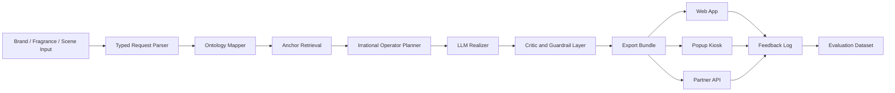

# Architecture

## Goal

Scent Myth Engine is a commercial scene-to-scent narrative system. It should generate fragrance copy that is clear enough to sell, concrete enough to imagine, and strange enough to remember.

## Recommended Architecture

## Five Core Layers

### 1. Canonical Ontology Layer

Purpose: define stable domain meaning.

Recommended standard direction:

- OWL 2 for formal classes and relations
- SKOS for note, accord, emotion, and scene vocabularies
- SHACL for validation constraints
- JSON Schema for runtime API I/O

### 2. Operational Knowledge Layer

MVP:

- JSON seed data
- PostgreSQL or simple file-based storage

V1:

- PostgreSQL + pgvector or Neo4j

V2:

- Neo4j + neosemantics, or GraphDB/Amazon Neptune if RDF-native enterprise reasoning becomes necessary

### 3. Retrieval Layer

Retrieval should provide anchors, not final prose.

Examples:

- fragrance note descriptors
- brand tone examples
- place/scene metadata
- taboo terms
- prior accepted outputs

### 4. Generation Orchestrator

The orchestrator should run generation in stages:

1. parse request
2. retrieve anchors
3. choose symbolic distortion operators
4. create a structured generation plan
5. generate commercial copy
6. run critic checks
7. export approved bundle

### 5. Evaluation and Feedback Layer

The system should record:

- user saves
- copy/export actions
- regeneration count
- human edits
- rejected terms
- brand approval status

These logs become the most valuable dataset.

## V1 Stack Recommendation

- Frontend: Next.js or static React
- Backend: FastAPI or Node.js
- Data: PostgreSQL + JSONB; pgvector optional
- Ontology seed: JSON + Markdown + schema files
- LLM: OpenAI structured outputs first
- Guardrails: taboo lexicon + readability critic + schema validation

## V2 Stack Recommendation

- Graph: Neo4j + n10s, or GraphDB/Neptune for RDF-native clients
- Retrieval: vector + graph hybrid
- Rerank: Cohere Rerank or equivalent
- Private deployment: Mistral/Llama + LoRA + vLLM only after client privacy demand appears

## Architecture Principle

Do not let the LLM invent the whole experience. The ontology should decide what must remain stable. The irrational layer should decide what can bend. The critic should decide what can be shown to a brand.
